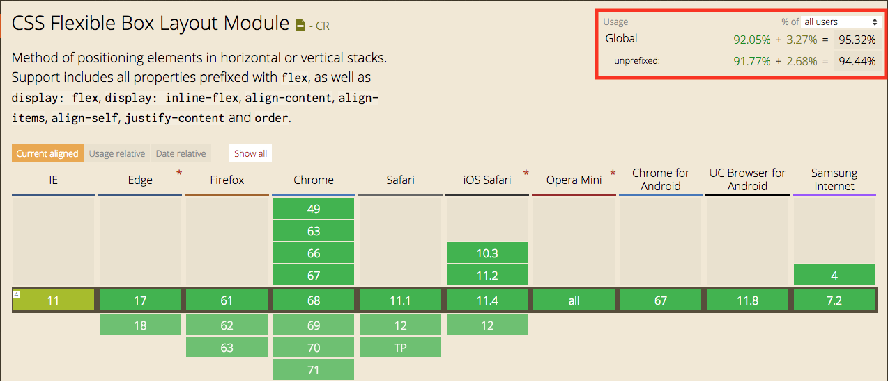

class: center, middle

# .center[Lunch & Learn]

## .center[Flexbox]

.logo[]

---

# Agenda

- **Introduction**
  - What is not
  - What is it?
  - Why we should use it?
- **Explanation**
  - Core concepts
  - How it works
    - Main & cross axes
    - Flex container and flex items
  - Flex container
  - Flex items
- **Wrapping**
  - Grid vs flex | Flex with grid
  - Native style
  - No new recomendations on the pipeline
  - Next steps

---

# What is not?

- CSS property
- Box sizing
- Another kind of grid

---

# What it is ?

Officialy it's name is

### [CSS Flexible Box Layout Module](https://www.w3.org/TR/css-flexbox-1/)

_"...In the flex layout model, the children of a flex container can be laid out in any direction, and can “flex” their sizes, either growing to fill unused space or shrinking to avoid overflowing the parent."_

From W3C Candidate Recommendation, 19 October 2017

---

# What it is ?

Is as a **one-dimensional layout model**, and as a method that could offer space distribution between items in an interface and powerful alignment capabilities.

When we describe flexbox as being one dimensional we are describing the fact that flexbox deals with layout in one dimension at a time (row or column). This can be contrasted with the **two-dimensional model** of _CSS Grid Layout_, which controls columns and rows together.

---

# Why we should use it?

---

# Why we should use it?

**inline-block**

<iframe scrolling='no' title='Layout inline-block' src='//codepen.io/pataruco/embed/WKyjja/?height=265&theme-id=dark&default-tab=css,result&embed-version=2' frameborder='no' allowtransparency='true' allowfullscreen='true' style='width: 100%; height: 30vh;'>See the Pen <a href='https://codepen.io/pataruco/pen/WKyjja/'>Layout inline-block</a> by Pedro Martin (<a href='https://codepen.io/pataruco'>@pataruco</a>) on <a href='https://codepen.io'>CodePen</a>.
</iframe>

---

# Why we should use it?

**float**

<iframe scrolling='no' title='Layout float' src='//codepen.io/pataruco/embed/ZjRyWO/?height=265&theme-id=dark&default-tab=css,result&embed-version=2' frameborder='no' allowtransparency='true' allowfullscreen='true' style='width: 100%; height: 30vh;'>See the Pen <a href='https://codepen.io/pataruco/pen/ZjRyWO/'>Layout float</a> by Pedro Martin (<a href='https://codepen.io/pataruco'>@pataruco</a>) on <a href='https://codepen.io'>CodePen</a>.
</iframe>

---

# Why we should use it?

**Flexbox**

<iframe scrolling='no' title='Layout flexbox' src='//codepen.io/pataruco/embed/yqEXVe/?height=265&theme-id=dark&default-tab=css,result&embed-version=2' frameborder='no' allowtransparency='true' allowfullscreen='true' style='width: 100%; height: 30vh;'>See the Pen <a href='https://codepen.io/pataruco/pen/yqEXVe/'>Layout flexbox</a> by Pedro Martin (<a href='https://codepen.io/pataruco'>@pataruco</a>) on <a href='https://codepen.io'>CodePen</a>.
</iframe>
